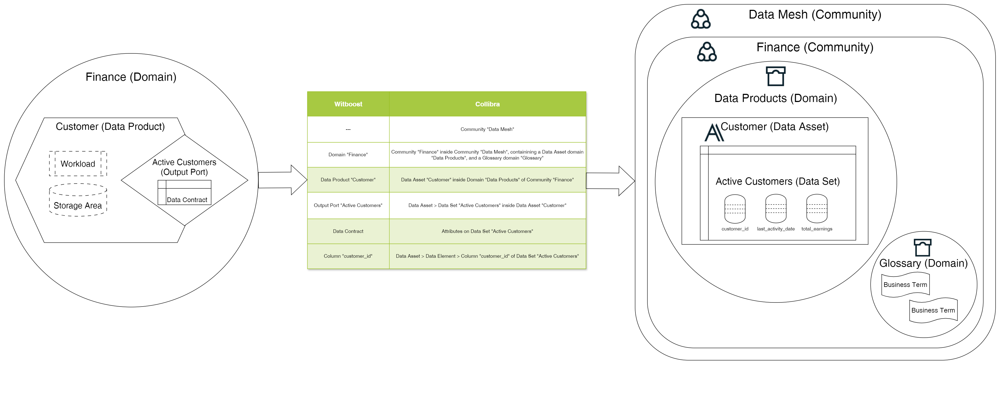

# HLD

This document describes the design of the Data Catalog Plugin for Collibra.

## Overview

### Data Catalog Plugin

A Data Catalog Plugin is a service in charge of publishing a Data Product onto a Data Catalog as part of the provisioning process on Witboost.

The Data Catalog Plugin is invoked by an upstream service of the Witboost platform, namely the Coordinator,  which is in charge of orchestrating the creation of a complex infrastructure by coordinating all the Data Product resource provisioning tasks performed by Tech Adapters (also known as Specific Provisioners) in a single workflow. The Data Catalog Plugin is called after all the Tech Adapters have successfully deployed their resources and receives a _Data Product descriptor_ as input with all the components of said Data Product, including any extra information that the Tech Adapters have returned as output of their operations.

To enable the above orchestration the Data Catalog Plugin exposes an API made up of four main operations:

- validate: checks if the provided data product descriptor is valid and reports any errors
- provision: publishes the validated descriptor on a data catalog; clients either receive an immediate response (synchronous) or a token to monitor the provisioning process (asynchronous)
- status: for asynchronous provisioning, provides the current status of a provisioning request using the provided token
- unprovision: unpublishes the previously created descriptor.

### Collibra

[Collibra](https://www.collibra.com) is a leading data intelligence company that offers a robust data catalog designed to empower organizations with a comprehensive data governance and management platform.

The Collibra Data Catalog provides a centralized repository where users can discover, understand, and trust their data across the enterprise. It enables seamless collaboration by allowing data stewards, analysts, and business users to find, classify, and govern data assets efficiently. With advanced features such as automated data lineage, metadata management, and data quality monitoring, Collibra ensures that data is accurate, consistent, and compliant with industry regulations. Its intuitive interface and powerful search capabilities make it easy for users to access critical information, fostering a data-driven culture and enhancing decision-making processes.

#### Mapping between Witboost and Collibra

Data Mesh entities in Witboost are mapped to Collibra concepts as follows:

| Witboost                       | Collibra                                                                                                                                                                                          |
|--------------------------------|---------------------------------------------------------------------------------------------------------------------------------------------------------------------------------------------------|
| ---                            | Community "Data Mesh"                                                                                                                                                                             |
| Domain "Finance"               | Community "Finance" inside Community "Data Mesh" which in turn will contain two Collibra domains: A Data Asset domain for storing Data Products, and a Glossary domain for storing Business Terms |
| Data Product "Customer"        | Data Asset "Customer" inside Data Asset Domain on Community "Finance"                                                                                                                             |
| Output Port "Active Customers" | Data Asset > Data Set "Active Customers" inside Data Asset "Customer"                                                                                                                             |
| Data Contract                  | Attributes on Data Set "Active Customers"                                                                                                                                                         |
| Column "customer_id"           | Data Asset > Data Element > Column "customer_id" of Data Set "Active Customers"                                                                                                                   |

As explained above, the concept of the Witboost Domain is made up of a Community containing two static different types of domain: A Data Asset Domain for storing Data Products, and a Glossary domain for storing Business Terms. The latter will be used to validate tags on the different assets.

A Community is added on top as a container for all Domains and Data Products in them, and the Data Product and its components are mapped 1-1 with Collibra entities maintaining the original containment/composition relationships.

This mapping relies only on the basic building blocks of Collibra and the packaged asset types that it provides out of the box.

The ids for the Collibra entities (such as the community, domain type, asset types etc) that are used in the mapping are configurable so that the Data Catalog Plugin can work with custom metamodels.

In summary, tha mapping that takes place looks like this:

For reference, the general model for Collibra is the following:

Further information can be found at the following links:

- https://productresources.collibra.com/docs/collibra/latest/Content/Architecture/ref_collibra-building-blocks.htm
- https://productresources.collibra.com/docs/collibra/latest/Content/Assets/AssetTypes/ref_ootb-asset-types.htm

## Startup

When the Data Catalog Plugin is executed, on startup it checks the existence of the above concepts, erroring out if it can't find them.

## Validating

Currently, the Collibra Data Catalog Plugin performs a simple validation of the descriptor checking its compliance with the Data Product Specification.

1. **Validate descriptor**: Upon receiving a Data Product descriptor, it is validated, checking for consistency and all required fields.

## Provisioning

1. **Validate descriptor**: Upon receiving a Data Product descriptor, it is validated, checking for consistency and all required fields.
2. **Creation of business assets**: After validation, the Data Catalog Plugin will provision the assets/relationships on Collibra as per the above table.
3. **Report Outcome**: After the assets have been published, the Data Catalog Plugin returns a `ProvisioningStatus`. This status confirms the successful creation of the assets, containing the necessary links to the Collibra UI.

## Unprovisioning

1. **Validate descriptor**: Upon receiving a Data Product descriptor, it is validated, checking for consistency and all required fields.
2. **Deletion of business assets**: After validation, the Data Catalog Plugin will unprovision all the previously created assets/relationships, except the Community and Domain, as they can be used by other Data Products in the Data Catalog.
3. **Report Outcome**: After the assets have been removed, the Data Catalog Plugin returns a `ProvisioningStatus`. This status confirms the successful deletion of the assets.

## Business term retrieval

Retrieval of business terms is tied to the Custom URL Picker endpoints, useful to retrieve the list of allowed values from Collibra Data Catalog to use during the creation of a component.

1. **Query business terms from glossary**: Upon receiving a Custom URL Picker requests, a query is sent to Collibra using the request body inputs including offset, limit, an optional text filter and an optional Witboost domain filter which is translated into the Collibra community as explained above. The business term asset type is taken from configuration.
2. **Return list of matching business terms**: After the query is resolved, its results are sent back to Witboost, sending the business term id and its value.

